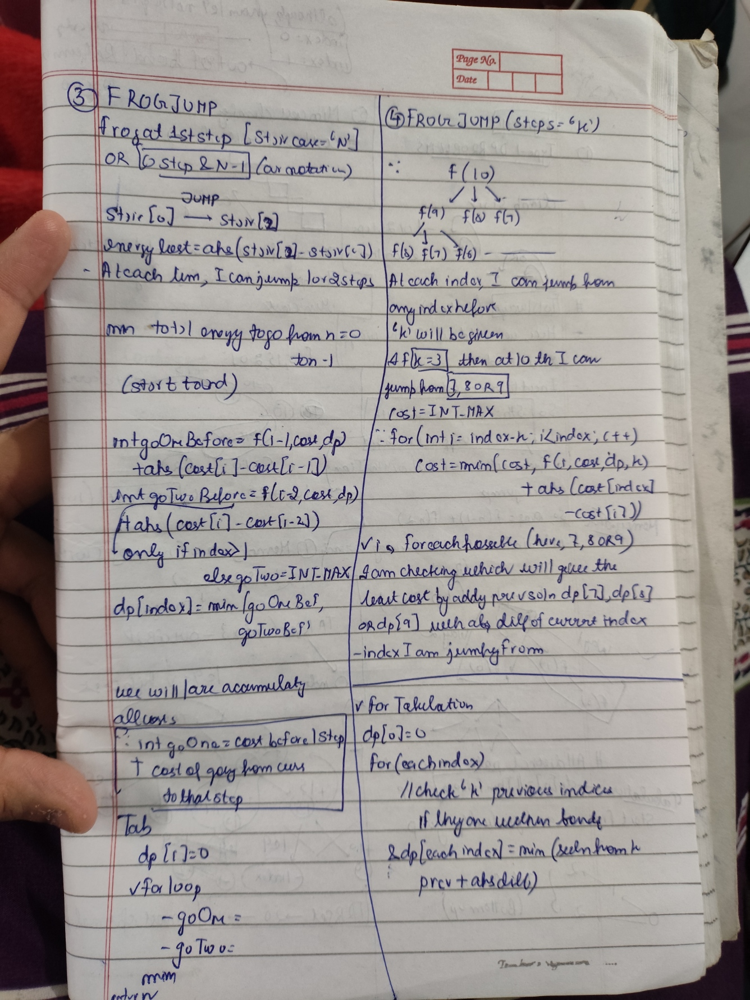

#### Problem Statement
- took me some time to solve so i will start with a wrong approach first of all
- okay so there is a frog at index 0 he needs to reach last index of the stair case. Now for reaching the last index, he can take either 1 or 2 steps in each case.  But catch is for taking each step. Imagine he jump from stair 0 to stair 2. He will spend energy abs(stair2 val-stair 0 val) to jump so we need to sum up all the anergy required
- okay so again I can start from last stair (n) and can construct solution (this is recursion/ top-Down/memoization)

```cpp
int memoizedSolution(int index,vector<int>&cost,vector<int>&dp)
    {
        if(index<0) return 1e9; //to emphasize this is very high cost and this route shouldnt be taken
        if(index==0) return 0;
        if(dp[index]!=-1) return dp[index];
        // this is currently wrong as i am just subtracting the abs values. dont taking into encounter the sum of cost already
        // int goLeft=memoizedSolution(index-1,heights,dp);
        // int goRight=memoizedSolution(index-2,heights,dp);
        // return dp[index]=min(abs(heights[index]-goLeft),abs(heights[index]-goRight));
        int goOneBefore = memoizedSolution(index - 1, cost, dp) + abs(cost[index] - cost[index - 1]);
        int goTwoBefore = (index > 1) ? memoizedSolution(index - 2, cost, dp) + abs(cost[index] - cost[index - 2]) : INT_MAX;

        return dp[index] = min(goOneBefore, goTwoBefore);
        

    }
```

### First of all i wrote some wrong code.
 // int goLeft=memoizedSolution(index-1,heights,dp);
        // int goRight=memoizedSolution(index-2,heights,dp);
        // return dp[index]=min(abs(heights[index]-goLeft),abs(heights[index]-goRight));
#### Now this is wrong as?
- i am doing my current value- answer of left. but i shall do answer of left+(currvalue- left(or i-1) index)
- similarly i shall do answer of right +(currValue-right(i-2) index). These things will help me accumulate the answer
- so what I can do is leftAnswer+abs(cost[index]-cost[index-1]); (i.e. leftAnswer+currentAnswer if he jumps one step )
- similarly rightAnswer+ current if he jumps 2. then takemin of both