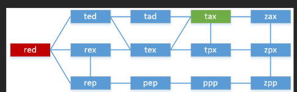

### Word Ladder 2
#### After so much (spending 1.5 hr a day, 1.5hr 2nd day), then also i took hints, then this approach (inspired by a solution but explained more better)
##### Okay so let me first try to explain the question to myself. These are the things given
- a startWord
- b an endWord
- I need to go from startWord to endWord. Now , the thing is instead of just one path, I need to find all shortest paths till there? Okay so I got it now
- So let me take one example




#### Now I need to reach from red to tax , okay sounds cool to me
##### So there are numerous ways . red->ted->tad->tax and so on.....
##### First think I thought was what if we created an entire graph already? Like maybe creating the entire adjList red->ted,rex,rep and so on.. But it will give a TLE error. Also, it will increase one difficulty a path can also be like red->rex->tpx->zpx->zax->tax (i.e. i went forward and came back?). To avoid this wenting forward and coming back, we would ofcourse need distance, which will represent, how much far are we from frontest element which is red. Now, since we need to find all possible paths, one thing that will ofcourse be applied is **DFS** and **Recursion** and **Backtracking**. These are the 3 things that will ofcourse be applied. Okay so let just think of DFS. I will start from red->ted->tex->tpx->tax . IN DFS directly, it's not necessary that first time when I reach tax it will be shortest. I need to make sure that first time I reach tax it will be shortest, so that for rest all paths I dont traverse longer than shortest distance. Thus, for first path I will apply BFS.

#### Let's just think how I will apply BFS
- I will push red to queue, then will see the neighbors then will go from a to z will see whether someone exist, Yes ted, rex,rep exist -> push to queue. And i will remove them from set (to just find one shortest path). Also, one question that come to mind is, if I remove rex from set, how will rex to rep go? Okay so i just need to find one shortest path till tax. Not all. if i am able to find one shortest paths (and all those elements involved in that shortest paths+ all that elements within that distance in the queue). THen anyhow, only thse elements in different order will contribute to our answer
- okay so I pushed **red** to queue, then ted rex rep, then I will push tad and tex then pep and then tax. Now i reached tax now i will break.. 
#### Reason of breaking at this point? Say i traverse further I will get tpx, ppp etc. which may contribute to answer but in a long path (Example red->rex->tex->tpx->tax). We dont need this long path, so we break off early as soon as we reach tax.
##### Also we would need a distance vector or map which will store distance[red]=1 , distance[ted]=2, distance[tad]=3 i,e, distance of that level

##### At end, i am at tax distance=4, so 4 is the shortest path. Now using DFS i will find all ways dis=4 to this tax. what i will do is i will start from tax, then go from a to z then will check what all neighbors do tax have -? tad,tpx, tex,zax . These 4 are the neighbors but only distance[tad] and distance[tex]=3. Meaning only these both can contribute to the answer. so i will push tad to the vector then i will push ted then red. Now i will backtrack and pop-out. again i will reach tax, this time i will go to tex then rex then red. again i will pop -out and backtrack. now tax doesnt have any more neighbors. now i will go to tad(first neighbor of tax i pushed to answer) and will check tad's neighbors(except those already done in loop).. and so on i will find all paths
```cpp
class Solution {
public:
    void dfs(
        string word,
        string beginWord,
        vector<string>&seq,
        unordered_map<string,int>&distance,
        vector<vector<string>>&ans
    ){
        if(word==beginWord){
            reverse(seq.begin(),seq.end());
            ans.push_back(seq);
            reverse(seq.begin(), seq.end());
            return;

        }
        int steps=distance[word]; //no of steps jo yhan aane m lge the
        for(int i=0;i<word.size();i++){
            char original=word[i];
            for(char ch='a';ch<='z';ch++){
                word[i]=ch;
                if(distance.count(word)&&distance[word]+1==steps){
                    // i.e. ek aisa word jo usse piche hai
                    seq.push_back(word);
                    dfs(word, beginWord, seq, distance, ans);
                    seq.pop_back();
                }
            }
            word[i]=original;
        }
    }
    vector<vector<string>> findLadders(string beginWord, string endWord, vector<string>& wordList) {
        unordered_set<string>wordSet(wordList.begin(),wordList.end());
        unordered_map<string,int>distance;
        vector<vector<string>> ans;
        queue<string> q;
        q.push(beginWord);
        distance[beginWord] = 1;
        wordSet.erase(beginWord);
        while(!q.empty()){
            string front=q.front();
            q.pop();
            int steps=distance[front]; //number of steps to come here
            if(front==endWord) break;
            for(int i=0;i<front.size();i++){
                char currentCharacter=front[i];
                for(char ch='a';ch<='z';ch++){
                    front[i]=ch;
                    if(wordSet.count(front)){
                        q.push(front);
                        wordSet.erase(front);
                        distance[front]=steps+1;
                    }
                }
                front[i]=currentCharacter; //replacing back to current character so that i can find further node

            }
        }
        if(distance.count(endWord)){
            vector<string>seq={endWord};
            dfs(endWord,beginWord,seq,distance,ans);
        }
        return ans;
    }
};
```