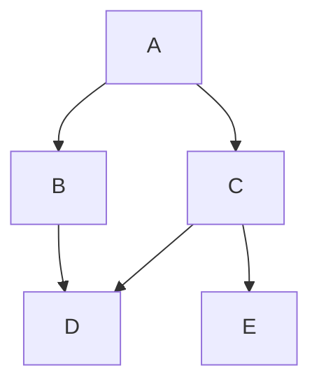

# Graph Representation

A **graph** is a data structure that consists of:
- **Nodes (Vertices):** Represented as circles.
- **Edges:** Represented as lines connecting nodes.
  - **Directed edges** (→) have a direction.
  - **Undirected edges** (—) do not have a direction.

## Types of Graphs

### Undirected Graph
An undirected graph has edges with no direction.

```mermaid
graph TD;
    A -- B;
    A -- C;
    B -- D;
    C -- D;
    C -- E;
```
### We also have concept of **degree**
- Degree means no of edges connected to a node (for undirected)
- For directed, it's **indegree** and **outdegree** which is edges coming in (how much) and edges going out (how much)
- for undirected graph, sum of degree of all nodes= no of edges
- i.e. **sigma degree**=number of edges
### Directed Graph
A directed graph has edges with specific directions.



## Usage
Graphs are widely used in:
- Social networks (friendship graphs)
- Route mapping (cities and roads)
- Web page ranking (Google's PageRank algorithm)

## Implementation
Graphs can be implemented using:
- **Adjacency List:** Each node stores a list of adjacent nodes.
- **Adjacency Matrix:** A 2D matrix where `matrix[i][j]` indicates an edge.

## How do we code them?

### Adjacency Matrix

An **Adjacency Matrix** is a **2D array** where each cell **[node1][node2]** represents whether there is an edge between `node1` and `node2`.
- If there is an edge, the value is `1` (or weight in weighted graphs).
- If there is no edge, the value is `0`.
- For an **undirected graph**, the matrix is symmetric (`adj[u][v] == adj[v][u]`).
- For a **directed graph**, `adj[u][v] = 1` means an edge from `u` to `v`, but `adj[v][u]` can remain `0`.

Let's consider a graph like this:
```
   (1) --- (2)
    |       |
   (3) --- (4)
```
The **Adjacency Matrix** representation would be:
```
    1  2  3  4
1  [0, 1, 1, 0]
2  [1, 0, 0, 1]
3  [1, 0, 0, 1]
4  [0, 1, 1, 0]
```
- > We dont write an edge between 1 & 1, i.e. same nodes no edge until there is a self -loop so that's understandable

### C++ Code Implementation
```cpp
#include <iostream>
#include <vector>
using namespace std;

int main() {
    int n, m;
    cout << "Enter the number of nodes and edges: ";
    cin >> n >> m;
  
    vector<vector<int>> adj(n + 1, vector<int>(n + 1, 0)); // this is O(n square) since we are explicitly declaring each value with 0
    
    cout << "Enter the edges (node1 node2):\n";
    for (int i = 0; i < m; i++) {
        int u, v;
        cin >> u >> v;
        adj[u][v] = 1; // Mark edge u->v
        adj[v][u] = 1; // Mark edge v->u (since undirected)
    }
    
    // Printing the adjacency matrix
    cout << "Adjacency Matrix:\n";
    for (int i = 1; i <= n; i++) {
        for (int j = 1; j <= n; j++) {
            cout << adj[i][j] << " ";
        }
        cout << endl;
    }
    return 0;
}
```

### Complexity Analysis
- **Time Complexity**: `O(m)`, where `m` is the number of edges (for inserting edges).
- **Space Complexity**: `O(n^2)`, as we store `n × n` matrix elements 

Adjacency matrices are useful for **dense graphs** but become inefficient for **sparse graphs** due to high space consumption.


**Adjacency List**
## Now I will implement same using adjacency list

Let's consider a graph like this:
```
   (1) --- (2)
    |       |
   (3) --- (4)
```
The **Adjacency List** can be represented as
- 1->2,3
- 2->1,4
- 3->1,4
- 4->2,3
## so we need a datastructure which can store integer mapping to a list /vector of integers
- we use data structures like vector<vector<int>> or vector<list<int>> or unordered_map<int,vector<int>> or unordered_map<int,list<int>>


## if the nodes are consecutive say starting from 0/1 to n then we prefer first or second , if nodes are not consectuive, we use a dynamic strategy of unordered map
```cpp
#include <iostream>
#include <vector>
#include<unordered_map>
using namespace std;
void vectorUsing()
{
  int n,m;
  //say n is the no of nodes, m is the no of edges
  cin>>n>>m;
  vector<vector<int>>adjList(n); //creates a 2d vector with n rows, 0 cols initially
  for(int i=0;i<m;i++){
    int u,v; // take input of which 2 nodes are connected
    cin>>u>>v;
    adjList[u].push_back(v);
    adjList[v].push_back(u);
  }
}
void usingMaps(){
  int n,m;
  cin>>n>>m;
  unordered_map<int,list<int>>adjList;
  for(int i=0;i<m;i++){
    int u,v; // take input of which 2 nodes are connected
    cin>>u>>v;
    adjList[u].push_back(v);
    adjList[v].push_back(u);
  }
  

}
int main()
{
  

}

```
## so more or less code of vector or maps is same as we are pushing back u->v v->u